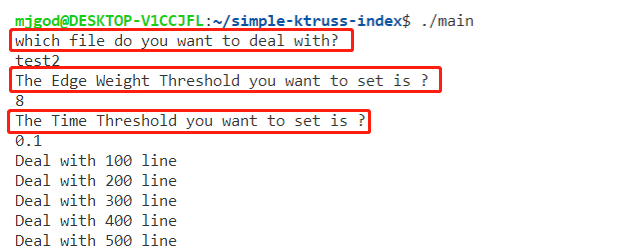
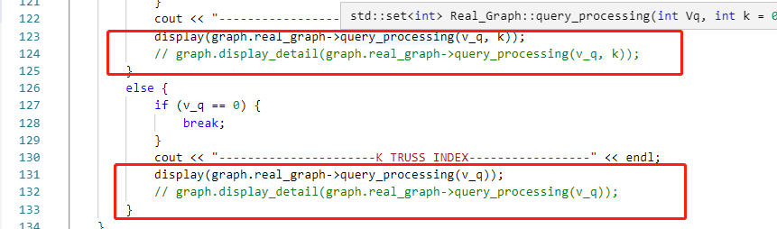
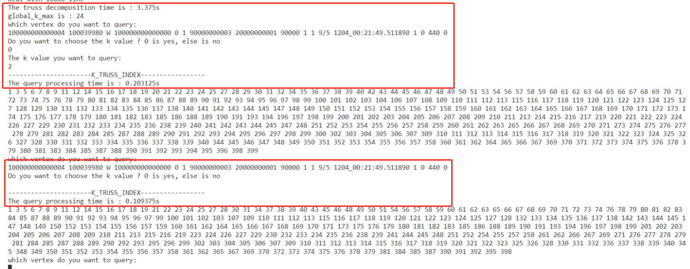
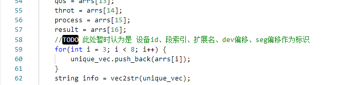

- 程序运行时流程如下
    1. 要求**输入文件的名字**（读取的文件格式是txt，不需要输入.txt后缀，只需要文件名即可）
    
    2. 要求**输入边的权重的阈值**，也就是边从出现边集合到真实边集合的条件
    
    3. 要求**输入时间阈值**，也就是控制历史窗口的大小的变量
    
    4. 然后程序就会开始处理文件，每处理100行就会显示一条信息。这个可以在代码中修改，位置是main.cpp（50行）
    
       

    5. 然后程序会显示**truss decomposition**的时间以及**整个图最大的k值**
    
    6. 接着程序会显示**查询哪个顶点**，输入想要查找的顶点的信息即可
    
    7. 接着程序会显示**是否要人为设置k值**，如果要则输入0，否则默认认为是最大的k值
    
    8. 然后程序会**输出查询时间以及显示相关的块的序号**，如果要显示块的具体信息可以将main.cpp(124, 132的地方的注释去掉)
    
    
    
    
    
    - 重复以上的过程
    
- **块的unique认定，也就是将那些属性作为唯一标示在代码utils.hpp（58行）**

- 对于未知的数据，**刚开始建议设置较大的边的权重阈值以及较小的时间阈值**，因为对于很稠密的图可能计算时间很久
- 提供的数据：（都是 设备id、段索引、扩展名、dev偏移、seg偏移作为标识）
    - test1.txt对应的是论文所给的图
- test2.txt对应的是400个数据块的10000条数据
    - 边的权重阈值设置为10以及时间间隔阈值为0.1时，分解时间为0.4秒
    - 边的权重阈值设置为9以及时间间隔阈值为0.1时，分解时间为3秒
    - 边的权重阈值设置为8以及时间间隔阈值为0.1时，分解时间为24秒
